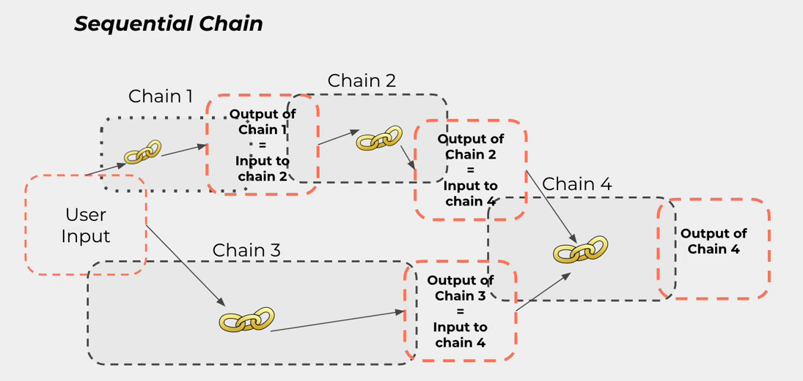
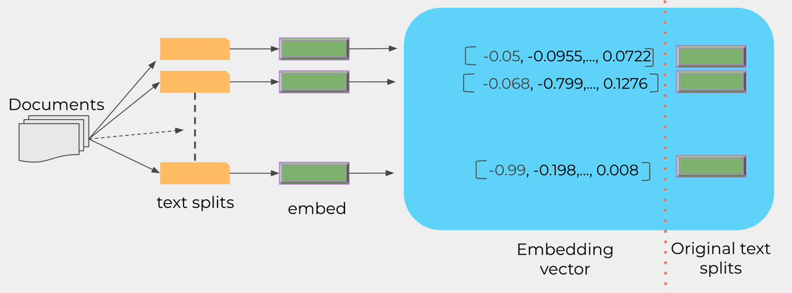

# Langchain - Basic Overview

## Introduction

Langchain is a framework for developing applications powered by large language models.


### How does it work?

The framework takes a document and transforms it into smaller chunks. Then it embeds each chunk into a embedding vector and stores them in a vector database.


Embedding is the representation of text in a high-dimensional space (768, 1536,...), which allows us to look for the most similar chunks in the vector space to our query.


## Components


### 1. Prompt Template


Example: 
```python
from langchain.prompts import ChatPromptTemplate
from langchain_openai import ChatOpenAI

# Initial template
template = """You are a techinical assistant. Base on the context, answer the question.

Context: {context}

Question: {question}

Answer:
"""

# Langchain prompt template
prompt_template = ChatPromptTemplate.from_template(template)

# Example usage
message = prompt_template.format_messages(
    context='...',
    question='...',
)

# Create LLM and get response
llm = ChatOpenAI(model='gpt-4o-mini', temperature=0.7)
response = llm(message)
```

### 2. Parser


Example:

```python
from langchain.output_parsers import ResponseSchema
from langchain.output_parsers import StructureOutputParser

# Define response schema
response_schema = [
    ResponseSchema(name='leave_time', description='A numerical time of a day. N/A if not available'),
    ResponseSchema(name='leave_from', description='A place (airport, city, province, country,...) where leave from. N/A if not available'),
    ResponseSchema(name='cities_to_visit', description='Places to visit, should be a list. [] (empty list) if not available'),
]

# Parse the output from LLM into JSON object like this
# {
#   "leave_time": "10:00", 
#   "leave_from": "HCM", 
#   "cities_to_visit": ["SGN", "Hanoi"]
# }

# Define output parser
output_parser = StructureOutputParser.from_response_schemas(response_schema)

format_instructions = output_parser.get_format_instructions()
print(format_instructions)

# The output should be a markdown code snipnet formatted in the following schema, including the leading and trailing "```json" and "```":
#
# ```json
# {
#     "leave_time": string // description 
#     "leave_from": string // description 
#     "cities_to_visit": string[] // description 
# }
# ```

# Create template
template = """From the following email, extract the following information

- leave_time: The time the person leave. If not available, return "N/A"
- leave_from: The place the person leave from. If not available, return "N/A"
- cities_to_visit: The list of cities the person visit. If there are more than 1 city, return them in a list (e.g. ["SGN", "Hanoi"]). If not available, return "[]"

Email:
{email}

{format_instructions}

Answer:
"""

# Create prompt template
prompt_template = ChatPromptTemplate.from_template(template)
# Format the template into messages
messages = prompt_template.format_messages(
    email='...',
    format_instructions=format_instructions,
)

# Create LLM and get response
llm = ChatOpenAI(model='gpt-4o-mini', temperature=0.7)
response = llm(messages)

# Parse the response
parsed_response = output_parser.parse(response)
print(parsed_response)

# Ensure types
print(type(parsed_response))                        # dict
print(type(parsed_response['cities_to_visit']))     # list
print(type(parsed_response['cities_to_visit'][0]))  # str
```

**Pydantic Parser**


```python
from pydantic import BaseModel, Field, validator
from langchain.output_parsers import PydanticParser
from typing import List

class LeaveInfo(BaseModel):
    leave_time: str = Field(description='The time the person leave. If not available, return "N/A"')
    leave_from: str = Field(description='The place the person leave from. If not available, return "N/A"')
    cities_to_visit: List[str] = Field(description='The list of cities the person visit. If there are more than 1 city, return them in a list (e.g. ["SGN", "Hanoi"]). If not available, return "[]"')

    # Custom validator
    @validator('cities_to_visit')
    def validate_cities_to_visit(cls, v):
        if not isinstance(v, list):
            raise ValueError('cities_to_visit must be a list')
        
        for city in v:
            if not isinstance(city, str):
                raise ValueError('cities_to_visit must be a list of strings')
        return v

pydantic_parser = PydanticParser(pydantic_object=LeaveInfo)

format_instructions = pydantic_parser.get_format_instructions()

# Create template, prompt template, send messages and get response from LLM as above
response = llm(messages)

# Parse the response
parsed_response = pydantic_parser.parse(response.content)
print(parsed_response)

# Ensure types
print(type(parsed_response))                       # __main__.LeaveInfo
print(type(parsed_response.cities_to_visit))       # list
print(type(parsed_response.cities_to_visit[0]))    # str
```

### 3. Memory

LLMs are stateless, they don't remember previous interactions. 


Langchain has different types of wrapper for memory:


Example:

```python
from langchain_openai import ChatOpenAI
from langchain.chains import ConversationChain
from langchain.memory import ConversationBufferMemory

llm = ChatOpenAI(model='gpt-4o-mini', temperature=0.7)

# Create memory
memory = ConversationBufferMemory()

# Create conversation chain
conversation = ConversationChain(llm=llm, memory=memory, verbose=True)

# Run conversation
conversation.predict('Hi, my name is Duy Anh')
conversation.predict('What is the capital of Vietnam?')
conversation.predict('What is my name?')

# Print conversation history
print(memory.load_memory_variables({}))
```

### 4. Chain

Chain allows us to make a series of LLM calls and pass the output of one LLM to the input of the next LLM.

Some types of chains:

- Simple Chain:


- Sequential Chain: a chain can take multiple LLMs as input (`input_variables`)


- Router Chain: depends on the input, it will call different LLMs


Example:
```python
from langchain.chains import LLMChain
from langchain.chat_models import ChatOpenAI
from langchain.prompts import PromptTemplate

llm = ChatOpenAI(model='gpt-4o-mini', temperature=0.7)

# Create prompt
prompt = PromptTemplate(
    input_variables=['word', 'language'],
    template='How to say {word} in {language}?'
)

# Create chain
chain = LLMChain(llm=llm, prompt=prompt, verbose=True)

# Run chain
response = chain({'word': 'Hello', 'language': 'Vietnamese'})
```

**Sequential Chain:**

```python
from langchain.chains import LLMChain, SequentialChain

# First chain
story_template = '''As a story writer, write a short story given topic and genre.

Topic: {topic}

Genre: {genre}
'''

story_prompt = PromptTemplate(
    input_variables=['topic', 'genre'],
    template=story_template,
)

story_chain = LLMChain(
    llm=llm, prompt=story_prompt,
    output_key='story'
)

# Second chain
translate_template = '''As a translator, translate the following story into {language}.

Story: {story}

Language: {language}
'''

translate_prompt = PromptTemplate(
    input_variables=['story', 'language'],
    template=translate_template,
)

translate_chain = LLMChain(
    llm=llm, prompt=translate_prompt,
    output_key='translated'
)

# Create Sequential chain
chain = SequentialChain(
    chains=[story_chain, translate_chain],
    input_variables=['topic', 'genre', 'language'],
    output_variables=['story', 'translated']
)

# Run chain
response = chain({'topic': '...', 'genre': '...', 'language': '...'})

print(response)
```

### 5. Document Loader, Splitter


- **Loaders** classes for accessing, processing and converting documents different data types (PDF, HTML, Word, Powerpoint, CSV, JSON, etc.) into format that LLMs can understand (list of docoment objects).


Example:
```python
# pip install pypdf
from langchain.document_loaders import PyPDFLoader

# Create loader
loader = PyPDFLoader('document.pdf')

# Load pages from document
pages = loader.load()

# Test
print(len(pages))
print(pages[0].page_content)
print(pages[0].metadata)
```

- **Splitter** classes for splitting documents into smaller chunks.


Example:
```python
from langchain.text_splitter import CharacterTextSplitter, RecursiveCharacterTextSplitter

# Open document
with open('document.pdf', 'rb') as f:
    speech = f.read()

# Create splitter
text_splitter = CharacterTextSplitter(
    chunk_size=100,
    chunk_overlap=20,
    length_function=len,
    # is_separator_regex=False,
)

texts = text_splitter.create_documents([speech])

# Recursive splitter: try to keep paragraphs sentencs and words as long as possible
# The strongest semantically related chunks of text
# Recommended to use in most cases

recursive_text_splitter = RecursiveCharacterTextSplitter(
    chunk_size=500,
    chunk_overlap=100,
    length_function=len,
    add_start_index=True,
)

documents = recursive_text_splitter.create_documents([speech])
```

### 6. Storage (Vector Store & Embeddings)


- Create vector store from documents (chunks):


- Embed query and search to find most similar content for the query:


Example:
```python
from langchain.embeddings import OpenAIEmbeddings
from langchain.vectorstores import Chroma # pip install chromadb
import numpy as np

# Create embeddings model
embeddings = OpenAIEmbeddings()

query1 = 'What is the capital of Vietnam?'
query2 = 'What is the capital of France?'

embeddings1 = embeddings.embed_query(query1)
embeddings2 = embeddings.embed_query(query2)

similarity = np.dot(embeddings1, embeddings2)

# Create vector store
vectorstore = Chroma.from_documents(
    documents=documents, # Suppose we have a list of documents split from a PDF file
    embedding=embeddings,
    persist_directory='./chroma_db',
)

question = 'What is the capital of Bolivia?'

# Search for most similar documents
docs = vectorstore.similarity_search(query=question, k=3)

# Print results
for doc in docs:
    print(doc.page_content)

# Save vector store for later usage
vectorstore.persist()
```

**Langchain Retriever:**
```python
vector_store = Chroma(
    persist_directory='./chroma_db',
    embedding_function=embeddings
)

# Create retriever
retriever = vector_store.as_retriever(
    search_kwargs={'k': 3},
    search_type='similarity'
)

docs = retriever.get_relevant_documents(question)

for doc in docs:
    print(doc.page_content)

```

Example: Make a chain to answer questions
```python
from langchain.chains import RetrievalQA
from langchain.prompts import PromptTemplate

# Create prompt
template = """Given the following documents, answer the question.

Documents: {context}

Question: {question}

Answer:"""

llm = ChatOpenAI(model='gpt-4o-mini', temperature=0.7)

prompt = PromptTemplate(
    input_variables=['context', 'question'],
    template=template,
)

# Create chain
chain = RetrievalQA.from_chain_type(
    llm=llm,
    chain_type='stuff',
    retriever=retriever,
    prompt=prompt,
    return_source_documents=True,
    verbose=True,
)

# Run chain
response = chain(question)

# Print result
print(response['result'])
for source in response['source_documents']:
    print(source.metadata['source'])
```

